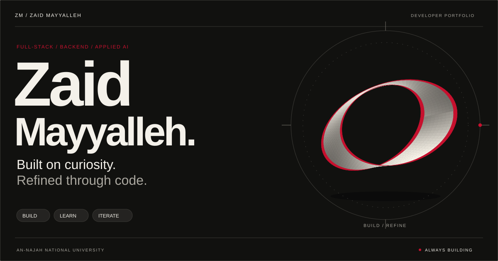
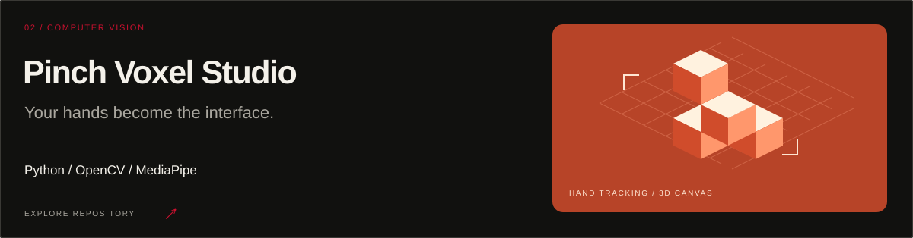
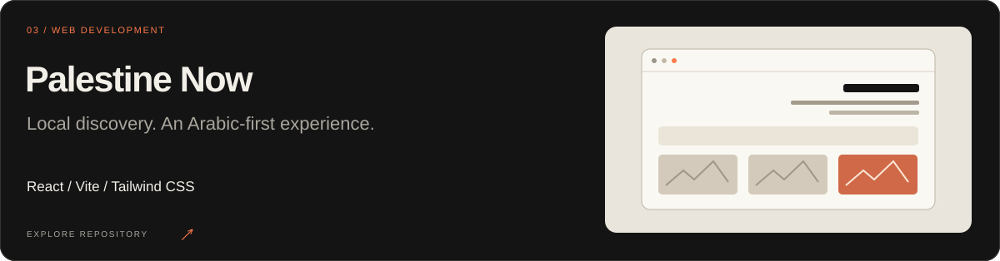
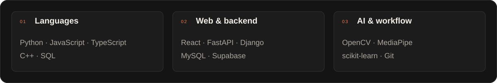
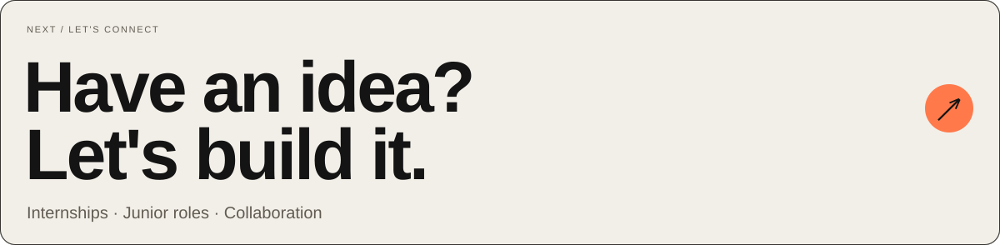

<picture>
  <source media="(max-width: 640px)" srcset="./assets/profile/hero-mobile.svg" />
  
</picture>

  <a href="#selected-work">Selected work</a> &nbsp; / &nbsp;
  <a href="#toolkit">Toolkit</a> &nbsp; / &nbsp;
  <a href="#by-the-commits">GitHub activity</a> &nbsp; / &nbsp;
  <a href="https://www.linkedin.com/in/zaid-mayyalleh-307499376/">LinkedIn ↗</a>

 

### Good software starts with a clear idea.

I'm **Zaid**, a student at **An-Najah National University** in Palestine, building across **full-stack development, backend systems, and applied AI**.

My work ranges from APIs with carefully modeled data to interfaces you can control with your hands. I care about clear responsibilities in code, useful product details, and understanding what happens beneath the abstraction.

Currently growing **Apex Intelligence**, sharpening my Python and system-design foundations, and turning what I learn into projects you can explore below.

 

## Selected work

01 / A selection of things I've built and explored.

  

<a href="https://github.com/zaidmoen/Books_manegment_MySQL">
  <picture>
    <source media="(max-width: 640px)" srcset="./assets/profile/project-api-mobile.svg" />
    
  </picture>
</a>

Schools, classes, books, and reviews in a relational backend. **Parameterized SQL, role-based access, and versioned migrations.**

 

<a href="https://github.com/zaidmoen/cube_builder">
  <picture>
    <source media="(max-width: 640px)" srcset="./assets/profile/project-voxel-mobile.svg" />
    
  </picture>
</a>

A webcam-driven voxel editor with **hand tracking, pinch gestures, isometric rendering, and scene persistence**.

 

<a href="https://github.com/zaidmoen/palestine-now-web">
  <picture>
    <source media="(max-width: 640px)" srcset="./assets/profile/project-web-mobile.svg" />
    
  </picture>
</a>

An Arabic-first product demo for local discovery, with **unified search, personalized feeds, and accessible RTL layouts**. Uses sample data.

 

<a href="https://github.com/zaidmoen/bank-marketing-ml-classification">
  <picture>
    <source media="(max-width: 640px)" srcset="./assets/profile/project-ml-mobile.svg" />
    
  </picture>
</a>

A classification study exploring **data preprocessing, model comparison, and evaluation** on bank-marketing data.

 

<strong>Also on my workbench ↗</strong>

 

| Project | What you'll find |
| :--- | :--- |
| [Django TaskFlow API](https://github.com/zaidmoen/Django-taskflow-api) | Task CRUD, search, filters, and a dashboard with an API debugger. |
| [Dynamic Programming](https://github.com/zaidmoen/Dynamic-Programming) | Knapsack, LCS, coin change, tree algorithms, and worked examples. |
| [Advanced Python](https://github.com/zaidmoen/Advanced_Python) | OOP, SOLID principles, and practical Python exercises. |
| [Python vs. Java: Multiple Inheritance](https://github.com/zaidmoen/Python-vs-Java-Multiple-Inheritance) | The diamond problem, Python's MRO, and Java's approach. |

 

## Toolkit

02 / Tools I use across projects and ongoing learning.

  

<picture>
  <source media="(max-width: 640px)" srcset="./assets/profile/stack-mobile.svg" />
  
</picture>

 

## By the commits

03 / The work behind the work.

  

<a href="https://github.com/zaidmoen?tab=repositories">
  <picture>
    <source media="(max-width: 640px)" srcset="./assets/stats/github-overview-mobile.svg" />
    
  </picture>
</a>

<picture>
  <source media="(max-width: 640px)" srcset="./assets/stats/github-details-mobile.svg" />
  
</picture>

Public data · Scheduled daily refresh · Language shares reflect repository counts, not proficiency. <a href="./docs/profile-maintenance.md#statistics">Metric definitions</a>.

  

<a href="mailto:zmayyalleh@gmail.com">
  <picture>
    <source media="(max-width: 640px)" srcset="./assets/profile/connect-mobile.svg" />
    
  </picture>
</a>

  <a href="mailto:zmayyalleh@gmail.com"><strong>Email me ↗</strong></a> &nbsp; / &nbsp;
  <a href="https://www.linkedin.com/in/zaid-mayyalleh-307499376/"><strong>Connect on LinkedIn ↗</strong></a> &nbsp; / &nbsp;
  <a href="https://github.com/zaidmoen?tab=repositories"><strong>All repositories ↗</strong></a>

ZAID MAYYALLEH &nbsp; · &nbsp; BUILT WITH CARE, FROM PALESTINE.

