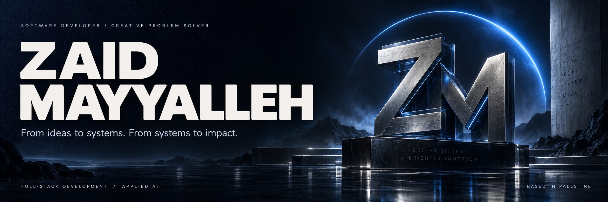
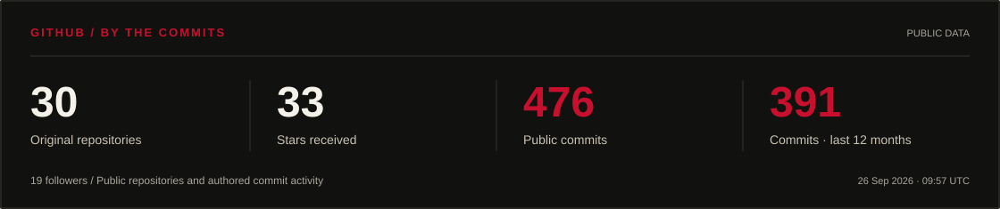
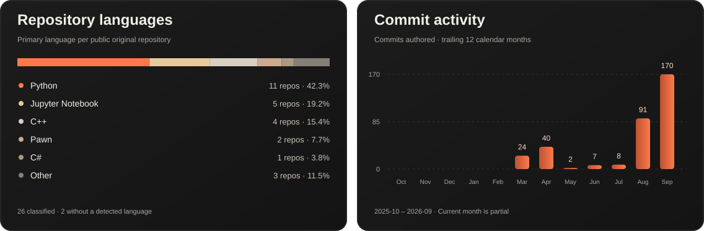
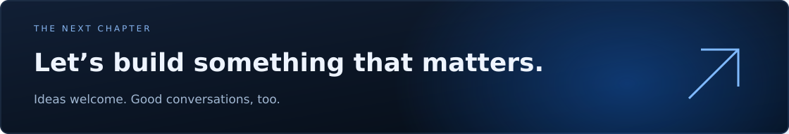

  
    
  
    
  <a href="https://www.linkedin.com/in/zaid-mayyalleh-307499376"><strong>LinkedIn</strong></a>
  &nbsp;&nbsp; / &nbsp;&nbsp;
  <a href="mailto:zaidmayyalleh@gmail.com"><strong>Email</strong></a>
  &nbsp;&nbsp; / &nbsp;&nbsp;
  <a href="https://github.com/zaidmoen?tab=repositories"><strong>Explore my work</strong></a>

 

### Good software starts with a real problem.

I'm **Zaid**, a Computer Science student at **An-Najah National University**, building across web development, backend systems, and applied AI. I enjoy the work between a first idea and a finished experience: shaping the interface, designing the data, and making the pieces work together.

My projects range from Arabic-first web experiences to gesture-controlled interfaces and Python APIs. Alongside them, I'm building **Apex Intelligence**, a student community and learning platform centered on programming and problem solving.

 

## 01 / Selected work

<table>
<tr>
<td width="50%" valign="top">

<h3>Information, designed around place.</h3>

An Arabic-first public-information interface exploring local discovery, search, and responsive RTL design.

<strong>Focus:</strong> Product experience · Frontend architecture

<a href="https://github.com/zaidmoen/palestine-now-web">Explore Palestine Now ↗</a>
</td>
<td width="50%" valign="top">

<h3>Your hands become the interface.</h3>

A creative coding project that combines hand tracking and computer vision to build a gesture-controlled voxel experience.

<strong>Focus:</strong> Computer vision · Human–computer interaction

<a href="https://github.com/zaidmoen/cube_builder">Explore Pinch Voxel Studio ↗</a>
</td>
</tr>
<tr>
<td width="50%" valign="top">

<h3>Beyond the CRUD endpoint.</h3>

A book-management backend for practicing raw SQL, authentication, relational data, reviews, and database migrations.

<strong>Focus:</strong> API design · Data integrity

<a href="https://github.com/zaidmoen/Books_manegment_MySQL">Explore Books Management API ↗</a>
</td>
<td width="50%" valign="top">

<h3>From data to a defensible result.</h3>

A machine-learning study exploring bank-marketing data through preprocessing, classification, and model evaluation.

<strong>Focus:</strong> Applied ML · Experimentation

<a href="https://github.com/zaidmoen/bank-marketing-ml-classification">Explore the ML study ↗</a>
</td>
</tr>
</table>

 

## 02 / Engineering in numbers

<a href="https://github.com/zaidmoen?tab=repositories">
<picture>
  <source media="(max-width: 640px)" srcset="./assets/stats/github-overview-mobile.svg" />
  
</picture>
</a>

<picture>
  <source media="(max-width: 640px)" srcset="./assets/stats/github-details-mobile.svg" />
  
</picture>

Public GitHub data · Refreshed daily · Language shares describe repositories, not proficiency. [Data & definitions](docs/profile-maintenance.md#statistics)

 

## 03 / Engineering toolkit

| Domain | Technologies I work with |
| :--- | :--- |
| **Languages** | Python · TypeScript · JavaScript · C++ · SQL |
| **Web** | React · Vite · Tailwind CSS · Material UI |
| **Backend & data** | FastAPI · MySQL · PostgreSQL · Supabase · REST APIs |
| **Applied AI** | scikit-learn · OpenCV · MediaPipe · Jupyter |
| **Development** | Git · GitHub · Postman · Figma |

 

## 04 / Beyond the code

**Better foundations.** Deepening Python, object-oriented design, SOLID principles, SQL, and algorithms through hands-on practice.

**Better products.** Connecting clear interfaces with thoughtful backend design, useful documentation, and behavior that can be tested.

**A stronger community.** Growing Apex Intelligence through collaborative projects, shared learning, and problem solving.

<strong>A few principles behind the work</strong>

 

- Start with the problem and make the assumptions explicit.
- Prefer clear responsibilities and readable code over unnecessary complexity.
- Review changes in focused branches and test the behavior that matters.
- Document how to run the project, what it does, and where its limitations are.

 

  
  
Open to internships, junior developer opportunities, and meaningful collaborations.

  
<a href="mailto:zaidmayyalleh@gmail.com"><strong>Let's talk ↗</strong></a> &nbsp; · &nbsp; <a href="https://www.linkedin.com/in/zaid-mayyalleh-307499376">Connect on LinkedIn</a>

   
  Zaid Mayyalleh &nbsp; / &nbsp; Built with intention. From Palestine.

