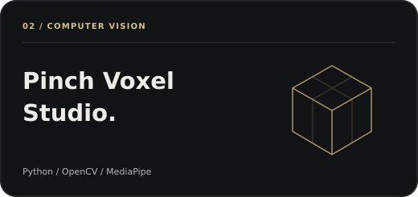
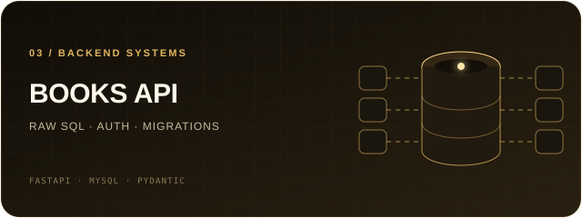
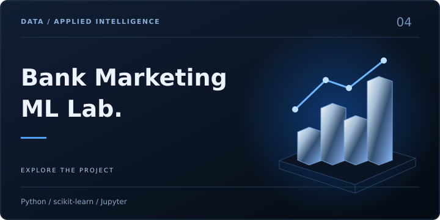

 

**Product-minded full-stack developer · Computer Science @ An-Najah National University · Palestine**

  <a href="https://www.linkedin.com/in/zaid-mayyalleh-307499376">LinkedIn</a>
  &nbsp;·&nbsp;
  <a href="mailto:zaidmayyalleh@gmail.com">Email</a>
  &nbsp;·&nbsp;
  <a href="https://github.com/zaidmoen?tab=repositories">All repositories</a>

## Engineering with purpose

I turn ambiguous ideas into useful, reliable software—from Arabic-first web products and secure APIs to computer-vision and machine-learning experiments. I care about clear architecture, honest user experiences, and the final details that make software feel finished.

> My north star: build things that solve a real problem, explain their trade-offs, and leave the codebase better than I found it.

## Selected systems

<table>
<tr>
<td width="50%" valign="top">

**An Arabic-first public-information product experience.**

Unified search, a personalized local feed, responsive RTL interfaces, accessibility support, lazy-loaded routes, and production quality checks—all presented with clear trust boundaries around demo data.

`React 19` `Vite` `Tailwind CSS` `Framer Motion`

[Explore the repository →](https://github.com/zaidmoen/palestine-now-web)

</td>
<td width="50%" valign="top">

**A 3D voxel builder controlled by hand gestures.**

Real-time hand tracking, a smoothed interaction cursor, multi-layer building, material modes, undo, and scene persistence turn a webcam into a hands-free creative interface.

`Python` `MediaPipe` `OpenCV` `Computer Vision`

[Explore the repository →](https://github.com/zaidmoen/cube_builder)

</td>
</tr>
<tr>
<td width="50%" valign="top">

**A raw-SQL backend designed like a real service.**

JWT authentication, role-based access, parameterized queries, relational constraints, versioned migrations, safe data backfills, REST endpoints, and a ready-to-use Postman collection.

`FastAPI` `MySQL` `Pydantic` `JWT`

[Explore the repository →](https://github.com/zaidmoen/Books_manegment_MySQL)

</td>
<td width="50%" valign="top">

**An end-to-end multiclass machine-learning study.**

Data exploration, preprocessing, K-Means analysis, MLP and Gradient Boosting comparison, stratified cross-validation, tuning, and results communicated through notebooks and a written report.

`Python` `scikit-learn` `Jupyter` `Machine Learning`

[Explore the repository →](https://github.com/zaidmoen/bank-marketing-ml-classification)

</td>
</tr>
</table>

## How I work

| Lens | What it means in practice |
| --- | --- |
| **Product** | Start with the user problem, make assumptions visible, and avoid pretending demo behavior is production behavior. |
| **Architecture** | Keep boundaries clear, data models intentional, APIs predictable, and migrations repeatable. |
| **Delivery** | Work in focused branches, review the diff, test behavior, and document the path from setup to result. |
| **Growth** | Learn in public through structured practice in SQL, Python, algorithms, AI, and system design. |

## Current focus

- Building **Apex Intelligence**, a collaborative academic platform for learning and problem solving.
- Evolving **Palestine Now** from a strong product demo toward a trustworthy, source-backed platform.
- Deepening backend engineering, databases, problem solving, and applied AI.

## Toolbox

| Area | Technologies |
| --- | --- |
| **Languages** | Python · C++ · JavaScript · TypeScript · SQL · C# |
| **Interfaces** | React · Vite · Tailwind CSS · Material UI · WPF |
| **Backends** | FastAPI · Node.js · Express · REST APIs |
| **Data** | MySQL · PostgreSQL · Supabase · schema design · migrations |
| **Intelligence** | scikit-learn · MediaPipe · OpenCV · reinforcement learning |
| **Workflow** | Git · GitHub · Postman · Figma · collaborative code review |

## Let’s build something useful

I’m open to internships, junior software-engineering roles, open-source work, and ambitious student collaborations.

[**Start a conversation on LinkedIn**](https://www.linkedin.com/in/zaid-mayyalleh-307499376) &nbsp;·&nbsp; [**Send me an email**](mailto:zaidmayyalleh@gmail.com)

Designed and maintained by Zaid Mayyalleh · Building from Palestine 🇵🇸

