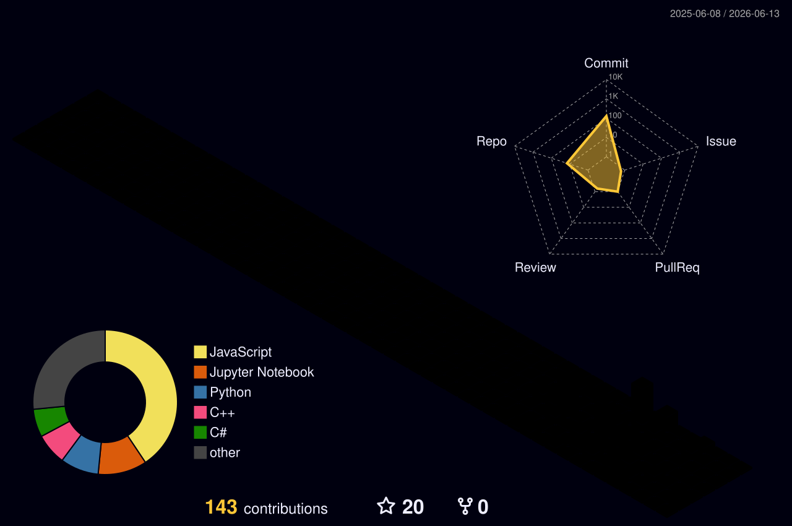

ها

<div align="center">

---

## 👨‍💻 About Me

```python
class ZaidMayyalleh:
    role = "Full-Stack Developer"
    education = "Computer Science Student"
    location = "Palestine 🇵🇸"

    interests = [
        "Backend architecture",
        "Modern web applications",
        "Artificial intelligence",
        "Problem solving",
    ]

    current_goal = "Build reliable software that creates real value."
```

I enjoy turning ideas into practical products, improving existing systems, and working across both frontend and backend development. My current focus is building production-minded applications with clean architecture, strong APIs, and thoughtful user experiences.

- 🎓 Computer Science student at **An-Najah National University**
- 💻 Building full-stack applications with modern JavaScript and Python stacks
- 🧠 Expanding my knowledge in AI, machine learning, and intelligent systems
- 🏗️ Interested in clean code, scalable architecture, and maintainable products
- 🤝 Open to internships, junior opportunities, and collaborative projects

---

## 🛠️ Technical Stack

<div align="center">

---

## 🚀 Featured Work

<table>
<tr>
<td width="50%" valign="top">

<div align="center">
  <a href="https://github.com/zaidmoen?tab=repositories">
    
  </a>
</div>

---

## 📊 GitHub Overview

<div align="center">

---

## 🐍 Contribution Journey

<div align="center">
  <picture>
    <source media="(prefers-color-scheme: dark)" srcset="https://raw.githubusercontent.com/zaidmoen/zaidmoen/output/github-contribution-grid-snake-dark.svg" />
    <source media="(prefers-color-scheme: light)" srcset="https://raw.githubusercontent.com/zaidmoen/zaidmoen/output/github-contribution-grid-snake.svg" />
    
  </picture>
</div>

---

## 🌌 3D Contribution Calendar

<div align="center">
  <picture>
    <source media="(prefers-color-scheme: dark)" srcset="./profile-3d-contrib/profile-night-rainbow.svg" />
    <source media="(prefers-color-scheme: light)" srcset="./profile-3d-contrib/profile-green-animate.svg" />
    
  </picture>
</div>

---

## 🤝 Let’s Build Something Useful

<div align="center">
