  
    
  
    
  <a href="https://www.linkedin.com/in/zaid-mayyalleh-307499376"><strong>LinkedIn</strong></a>
  &nbsp;&nbsp; / &nbsp;&nbsp;
  <a href="mailto:zaidmayyalleh@gmail.com"><strong>Email</strong></a>
  &nbsp;&nbsp; / &nbsp;&nbsp;
  <a href="https://github.com/zaidmoen?tab=repositories"><strong>Explore my work</strong></a>

 

<table>
<tr>
<td width="68%" valign="top">

## Building systems with intent.

I'm **Zaid Mayyalleh**, a Computer Science student at **An-Najah National University** and a developer interested in the space where product experience, backend engineering, and applied AI meet.

I like turning an unclear idea into something people can actually use: a considered interface, a reliable API, a useful data model, or a tool that makes difficult work feel simpler.

</td>
<td width="32%" valign="top">

<strong>Based in</strong> 
Palestine

<strong>Focus</strong> 
Full-stack · APIs · Applied AI

<strong>Currently</strong> 
Building with purpose

</td>
</tr>
</table>

 

 

## 01 / What I build

<table>
<tr>
<td width="33%" valign="top">
<h3>Product experiences</h3>
I care about the details that make a product feel obvious: clear flows, responsive layouts, accessible interfaces, and Arabic-first experiences when the audience calls for it.
</td>
<td width="33%" valign="top">
<h3>Backend systems</h3>
I design APIs and data layers with an eye for ownership, validation, migrations, and behavior that remains understandable as the project grows.
</td>
<td width="33%" valign="top">
<h3>Applied intelligence</h3>
I enjoy practical AI and computer-vision work—especially when a model becomes part of a useful human experience instead of a disconnected demo.
</td>
</tr>
</table>

 

## 02 / Selected work

<table>
<tr>
<td width="50%" valign="top">

<h3>Information, designed around place.</h3>
An Arabic-first public-information interface exploring local discovery, search, and responsive RTL design.
  <strong>Focus:</strong> Product experience · Frontend architecture
  <a href="https://github.com/zaidmoen/palestine-now-web">Explore Palestine Now ↗</a>
</td>
<td width="50%" valign="top">

<h3>Your hands become the interface.</h3>
A creative coding project combining hand tracking and computer vision to build a gesture-controlled voxel experience.
  <strong>Focus:</strong> Computer vision · Human–computer interaction
  <a href="https://github.com/zaidmoen/cube_builder">Explore Pinch Voxel Studio ↗</a>
</td>
</tr>
<tr>
<td width="50%" valign="top">

<h3>Beyond the CRUD endpoint.</h3>
A book-management backend for practicing raw SQL, authentication, relational data, reviews, and database migrations.
  <strong>Focus:</strong> API design · Data integrity
  <a href="https://github.com/zaidmoen/Books_manegment_MySQL">Explore Books Management API ↗</a>
</td>
<td width="50%" valign="top">

<h3>From data to a defensible result.</h3>
A machine-learning study exploring bank-marketing data through preprocessing, classification, and model evaluation.
  <strong>Focus:</strong> Applied ML · Experimentation
  <a href="https://github.com/zaidmoen/bank-marketing-ml-classification">Explore the ML study ↗</a>
</td>
</tr>
</table>

 

## 03 / Engineering telemetry

<a href="https://github.com/zaidmoen?tab=repositories">
<picture>
  <source media="(max-width: 640px)" srcset="./assets/stats/github-overview-mobile.svg" />
  
</picture>
</a>

<picture>
  <source media="(max-width: 640px)" srcset="./assets/stats/github-details-mobile.svg" />
  
</picture>

Public GitHub data · Refreshed daily · Language shares describe repositories, not proficiency. <a href="./docs/profile-maintenance.md#statistics">Data &amp; definitions</a>

 

## 04 / Toolkit

| Area | Tools I use |
| :--- | :--- |
| **Languages** | Python · TypeScript · JavaScript · C++ · SQL |
| **Web** | React · Vite · Tailwind CSS · Material UI |
| **Backend & data** | FastAPI · MySQL · PostgreSQL · Supabase · REST APIs |
| **Applied AI** | scikit-learn · OpenCV · MediaPipe · Jupyter |
| **Workflow** | Git · GitHub · Postman · Figma |

 

## 05 / How I work

<table>
<tr>
<td width="33%" valign="top"><strong>01 — Clarify</strong> Start with the real problem, the user, and the assumptions that shape the solution.</td>
<td width="33%" valign="top"><strong>02 — Simplify</strong> Prefer clear responsibilities and useful abstractions over complexity that only looks impressive.</td>
<td width="33%" valign="top"><strong>03 — Ship</strong> Document the behavior, test what matters, and keep improving through focused iterations.</td>
</tr>
</table>

 

  
  <h3>Have something worth building?</h3>
  
Open to internships, junior developer opportunities, and meaningful collaborations.

  
<a href="mailto:zaidmayyalleh@gmail.com"><strong>Let's talk ↗</strong></a> &nbsp; · &nbsp; <a href="https://www.linkedin.com/in/zaid-mayyalleh-307499376">Connect on LinkedIn</a>

   
  Zaid Mayyalleh &nbsp; / &nbsp; Built with intention. From Palestine.

